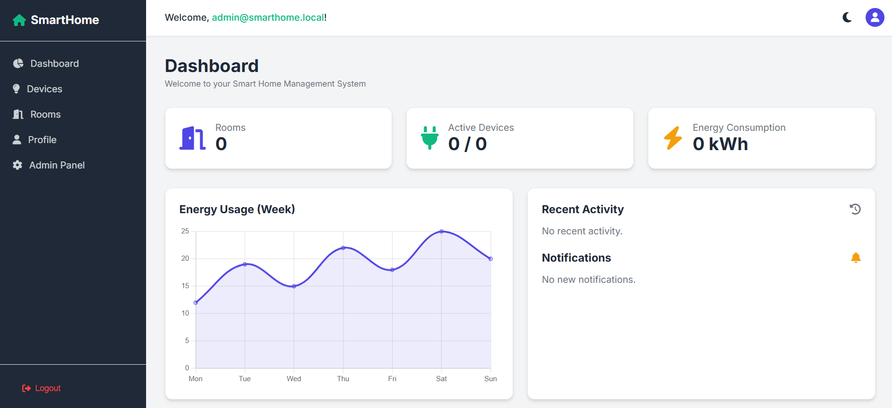

# Smart House Management Platform



## Overview

Smart House Management Platform is an application designed to manage and monitor smart home devices, 
allowing users to control lighting, temperature, and other household systems efficiently from a 
centralized platform.

## Features

- **Dashboard**: Centralized overview of the house, aggregating rooms, devices, and total energy consumption.
- **Room Management**: Organize devices by room for easier navigation and control.
- **Device Management**: Create, clone, configure, and control devices (lights, air conditioners, sensors, cameras, smart doors, alarms, thermostats, energy meters).
- **Device Control**: Turn devices ON/OFF and change their operating mode, with allowed transitions enforced per device state.
- **Energy Consumption Tracking**: Automatic energy usage calculation, tailored to each device type.
- **Device History & Notifications**: Every device action is logged and can trigger notifications for the user.
- **External Device Import**: Import devices from an external/simulated source into the system.
- **User Profile Management**: Manage account details and personal information.
- **Admin Management**: Administrative panel for managing users, roles, and devices.
- **Authentication & Authorization**: Secure login and registration, with role-based access (`ROLE_USER`, `ROLE_ADMIN`).
- **Design Patterns**: The codebase applies a broad set of Creational, Structural, and Behavioral design patterns (Factory Method, Abstract Factory, Builder, Prototype, Adapter, Decorator, Facade, Composite, Observer, Strategy, Command, State).

## Technologies

- **Framework & Architecture**: Spring Boot, Spring MVC, Thymeleaf
- **Security**: Spring Security
- **Database**: PostgreSQL, Spring Data JPA / Hibernate
- **Utilities**: Lombok
- **Monitoring**: Spring Boot Actuator
- **Build Tool**: Maven
- **Language**: Java 17
- **Development Tools**: IntelliJ IDEA / Visual Studio Code
- **Version Control & Repository**: Git, GitHub

## Resources

- [Spring Boot Documentation](https://docs.spring.io/spring-boot/index.html)
- [Spring Security Documentation](https://docs.spring.io/spring-security/reference/index.html)
- [Spring Data JPA Documentation](https://docs.spring.io/spring-data/jpa/reference/index.html)
- [Thymeleaf Documentation](https://www.thymeleaf.org/documentation.html)

## Installation

To install the application, follow these steps:

1. **Clone this repository:**
```bash
   git clone https://github.com/Constantin-Stamate/smart-home-management-platform
```

2. **Navigate to the project directory:**
```bash
   cd smart-home-management-platform
```

3. **Start a PostgreSQL database (Docker):**
```bash
   docker run --name smart-house-db -e POSTGRES_PASSWORD=smarthousepass -p 5433:5432 -d postgres:latest
```

4. **Restore dependencies:**
```bash
   ./mvnw clean install
```

5. **Run the application:**
```bash
   ./mvnw spring-boot:run
```
The application will be available at `http://127.0.0.1:8080`.

## Contributors

**Smart House Management Platform** was developed as part of a Design Patterns project. This project
welcomes contributions from developers interested in improving functionality, adding features, or
fixing bugs.

- GitHub: [Constantin-Stamate](https://github.com/Constantin-Stamate)
- Email: constantinstamate.r@gmail.com